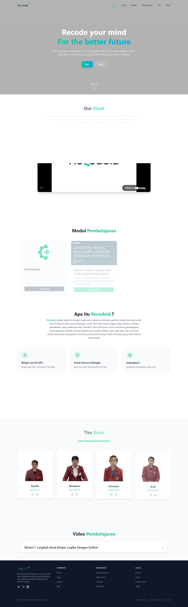

# RecodeID

> Course online berbasis website

Aplikasi ini dibuat untuk memenuhi tugas Mata Kuliah E-Bussines.

---

### Daftar Isi

- Tentang Proyek
- Fitur Utama
- Tangkapan Layar
- Teknologi yang Digunakan
- Kredit

---

## Tentang Proyek

RecodeID adalah jasa penyedia course/kelas online berbasis website yang berfokus pada pemblajaran logika menggunakan pyhton

---

## Fitur Utama

Berikut adalah fungsi dan fitur-fitur utama yang ada di dalam aplikasi ini:

- **Modul Pembelajaran**
- **Forum Diskusi**
- **Video Pembelajaran**

---

## Tangkapan Layar (Screenshot)

Berikut adalah beberapa tampilan dari aplikasi yang telah dibuat:

|               Halaman Home                |
| :---------------------------------------: |
|  |

---

## Teknologi yang Digunakan

Proyek ini dibangun menggunakan beberapa teknologi, antara lain:

- **Frontend:** React, typescripts, Tailwind CSS, Framer Motion
- **Backend:** -
- **Database:** -
- **Framework:** React Vite

---

## Kredit

Proyek ini disusun dan dikembangkan oleh:

| Nama Mahasiswa                 | NIM          | Username Github    |
| ------------------------------ | ------------ | ------------------ |
| **I Wayan Agus Wiradana**      | `2401010112` | **yanguswiradana** |
| **I Gede Gandhi Waisnawa**     | `2401010113` | **gandhibuahaha**  |
| **I Jhonatan Kevin Marandita** | `2401010143` | **dhsau**          |
| **I Kadek Budiarsa**           | `2401010145` | **Budi05986**      |

 

**Dosen Pengampu Mata Kuliah:**

**Ir. I Nyoman Tri Anindia Putra, S.Kom., M.Cs**

---
